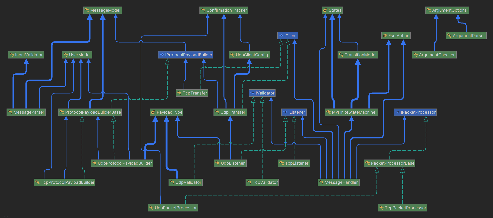
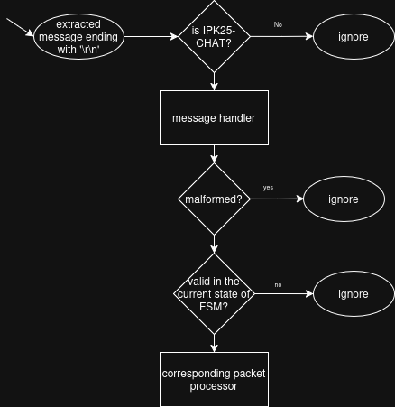
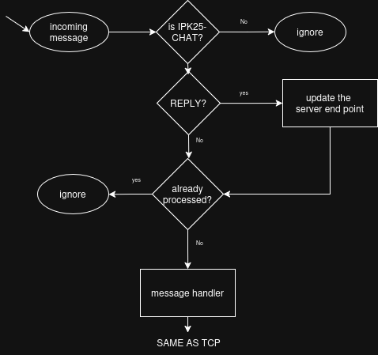

# Project 2 - IPK25 Chat Client

---
- **Author:** Adam Běhoun
- **Login:** xbehoua00
---

This project is implemented in C# using .NET 9.0 in an object-oriented manner.
	
## Table of Contents

// TODO: table of contents

### Usage

To compile this project, use `make` command in the terminal. This will create a binary file named **ipk25chat-client**.

#### Command-line arguments
`./ipk25chat-client -t <udp/tcp> -s <ip/hostname> [-p <port>] [-d <timeout>] [-r <retries>] [-h]`
- where:
  - `-t` - transport protocol (udp or tcp)
  - `-s` - server address (IP address or hostname)
  - `-p` - port number (4567 is default)
  - `-d` - timeout (in ms) on waiting for a **confirmation** message (UDP only, default is 250ms)
  - `-r` - number of message retransmissions (UDP only, default is 3) 
  - `-h` - print help message and exit
  

For command-line arguments parsing, the `CommandLineParser` NuGet package is used. 

## Project overview
The project implements a client that communicates with a specified server using `IPK25-CHAT` protocol. The communication can be performed over two different transport protocols - **TCP** and **UDP**. The validation of the communication is controlled by the **FSM** - finite state machine. 

### Allowed user commands
- `/help` - prints out the list of available commands
- `/auth <username> <display name> <secret>` - sends authentication request to the server and waits for a **reply** message signaling the success or the failure.
- `/join <channelID>` - sends a request to join the specified channel. Again the **reply** message is expected with the result of the request.
- `<msg>` - sends a message to the server.
- `/bye` - triggered by the user with `Ctrl+C` or `Ctrl+D` signalizing the end of the communication and **graceful** termination.

Very simplified and abstract flow-chart diagram be shown as follows (doesn't show the communication with the server):

.png)

## Project structure
As mentioned, the project follows the object-oriented design.
- `CLI` - contains classes for command-line parsing and validation. Parsed arguments are further passed to the program.
- `Clients` - contains two interfaces for **listener** and **transfer** (sending the messages) and its implementations for each transport protocol. There is also `ConfirmationTracker.cs` class that is responsible for tracking **confirmation** messages from the server and informing the **transfer** (only used for UDP).
- `FSM` - contains the implementation of the **finite state machine**
- `InputParse` - classes responsible for validating the input messages (`InputValidator.cs`) from the user and transforming them into suitable format for further processing (`MessageParser.cs`).
- `Models` - contains abstract representations of core models used in the program. 
  - `MessageModel.cs` is the collection of data needed for the message <-> IPK25-CHAT protocol conversion. 
  - `TransitionModel.cs` - represents the transition in the **FSM**.
  - `UserModel.cs` - contains the user data - most importantly the **display name** that can be changed during the runtime.
  - `UdpClientConfig.cs` - just an abstraction for the collection of UDP protocol configuration data (eg. retry count, timeout,...).
- `PacketProcess` - responsible for processing the incoming messages. Consists of an interface that is implemented by the two transport protocols again.
- `PayloadBuilders` - transforms the `MessageModel` into the **IPK25-CHAT** protocol format based on the type of transport protocol.
- `Validators` - validates the incoming messages from the server.
- `MessageHandler.cs` - all outgoing and incoming messages are processed here. It is driven by the **FSM**.
- `AppFactory.cs` - initializes the program based on the protocol specified.
- `Program.cs` - the main method of the program.

### Structure and usage between the components shown in the diagram
- blue lines represents the usage
- green dotted lines represents the inheritance



## Transportation protocols
They operate on the L4 of the OSI model. The end points of the communication are specified by the **IP** address and the **port** number. Even though transport protocols like **SCTP**, **QUIC** and others are still becoming more popular, the most widely used are **TCP** and **UDP**. [1]

## TCP protocol
TCP is a point-to-point protocol (1 sender, 1 receiver). It guarantees the delivery of the packets in the same order as they were sent. But this requires some preparation of the communication in some form of **handshake**. But the protocol does **not** guarantee that the packets will be delivered in one piece. This behaviour needs to be handled by the program. [1],[2]

### Implementation of TCP protocol
The core of the implementation is based on the built in `TcpClient` class. When the program is executed, the server end point is created and the connection is established. 
```csharp
tcpClient.Connect(serverEndPoint);
```
This client is used both in the **listener** and **transfer** classes. 

#### Sending
Before the message is sent, it needs to be converted into the **IPK25-CHAT** protocol format. This is done by the `PayloadBuilder` class. Then it is simply sent using these three lines:
```csharp
NetworkStream stream = _tcpClient.GetStream();
stream.Write(payload, 0, payload.Length);
stream.Flush();
```

#### Listening
This is more complicated. As mentioned, the TCP protocol does not guarantee that the packets will be delivered in one piece. Fortunately, the protocol specifies that the packet message is terminated by the `'\r\n'` sequence.
Therefore, the incoming bytes are stored in the `List<byte>` and when the desired sequence is found, the whole message is processed.

Processing the message means:
- **validation** - the message format is validated using `regular expressions` that are specified based on the **ABNF** grammar.
- **suitability check** - the message is checked if it is available in the current state of the **FSM**. If not, the message is ignored.
- **parsing** - the message is then parsed into the specified format and printed out to the standard output.

Here is the example of using regular expression for validation. The logic behind this is to store all the valid regexes into a list and on the server incoming message iterate through it to see if there is a check.
```csharp
const string fromRegex = @"[fF][rR][oO][mM]";
const string byeRegex = @"[bB][yY][eE]";
const string displayNameRegex = @"[\x21-\x7E]{1,20}";
...
new KeyValuePair<Regex, MessageType>(
    new Regex($@"{byeRegex}\s{fromRegex}\s{displayNameRegex}\r\n"), MessageType.BYE)
...
if (regex.Key.IsMatch(Encoding.ASCII.GetString(message)))
    return regex.Value; // return the corresponding message type (BYE in this case)
```

#### Message processing diagram



## UDP protocol
Simple transport protocol that does not guarantee the delivery of the packets nor the same order of the packets as they were sent.
There is no need for some form of **handshake** since the protocol is **connection-less**. It is assumed, that the **IP** protocol is used as underlying protocol. [1],[2],[3]

### Implementation of UDP protocol
Because of the unreliable delivery, the program needs some kind of assurance of the successful delivery of the packets. This is done by sending the **confirmation** message back to the sender. The confirmation packet consists of its type (`0x00`) and the **message ID** of the original message. 

#### Confirmation tracker
For this purpose, the `ConcurrentDictionary<string, ManualResetEventSlim>` is used. Where `string` is the **message ID** and `ManualResetEventSlim` behaves like a semaphore. When the message is sent, the program waits for the listener to trigger the semaphore (when the **confirmation** message comes). If the semaphore is not triggered within the specified timeout, the message is sent again. [4][5]

#### Sending
The sending works with the `UdpClient` class. Another obstacle in the UDP is that the first message is sent to `4567 or specified port` and the following communication is switched to dynamic port. This is resolved by the `UdpListener` that switches the server end-point when **REPLY** message is received.

#### Listening
Another obstacle may be **duplicate** message processing. Since it cannot be guaranteed that our confirmation message will be delivered, the server may send the same message again. This is resolved by keeping the processed message **IDs** in the `HashSet<string>`. So the message validation can be described with a diagram like this:



## FSM (finite state machine)
As mentioned, the communication is controlled by the **FSM**. But in this project it doesn't mean that the main flow of the program is executed there. It means that the **FSM** oversees and guides the `MessageHandler.cs` class that is responsible for sending and receiving messages. 
### Implementation of FSM
The **FSM** is implemented in the `MyFiniteStateMachine.cs` class. It uses the `TransitionModel.cs` to build the available transitions. So on **initial** and every other state, the available transitions for this state are stored in the `List<TransitionModel> _currentAvailableTransitions` and as the program flows, they invalid states are removed. This is an example of the specified transition:
```csharp
new(States.START, States.AUTH, MessageType.BLANK, MessageType.AUTH, true, false),
```
where:
- `States.START` - initial state
- `States.AUTH` - the next state
- `MessageType.BLANK` - the message that is expected from the server
- `MessageType.AUTH` - the message that is expected from the user
- `true` - the message is received from the server (since it is blank (no message needed) here, it is received on initialization)
- `false` - the message from the user is not yet received

So when the user sends the **AUTH** message, the transition has the two last values set to `true`, meaning that transition needs to be performed. When the transition is performed, the state variable is changes and the available transitions are updated.


## Testing

### Automated tests
Validation of core components of this project is done using `xUnit` testing framework. With total of 81 tests it covers the following:
- `MessageParserTests.cs` - conversion of the user messages to the `MessageModel`
- `MyFiniteStateMachineTests.cs` - mostly covers if the message is valid in the current state with various modifications
- `UdpProtocolPayloadBuilderTests.cs` - testing conversion of the `MessageModel` to the **IPK25-CHAT** protocol format for UDP
- `TcpProtocolPayloadBuilderTests.cs` - testing conversion of the `MessageModel` to the **IPK25-CHAT** protocol format for TCP
- `TcpListenerTests.cs` - testing when should the message be processed and when not
- `UdpValidatorTests.cs` - covers the validation of the incoming UDP messages from the server (null termination, required fields, ...)
- `TcpValidatorTests.cs` - covers the validation of the extracted TCP messages

### Manual tests
The program was tested in three stages. Since fair part of the project was tested with automatic tests, the manual tests are focused on sending and receiving messages themselves.

Firstly, it needed to be tested if the client is even sending the messages to the server. Therefore the server implemented in Python was started and was simply printing out the incoming messages (the user messages).

#### 1. UDP:
```
# Client
---------------------
➜  IPK25-chat git:(main) ✗ ./ipk25chat-client -s 127.0.0.1 -t udp
Listening for user input...
/auth username secret displayName

# Server
---------------------
UDP server listening on port 4567...
Received message from ('127.0.0.1', 44551): b'\x02\x00\x00username\x00displayName\x00secret\x00'
```

#### 1. TCP:
```
# Client
----------------------
➜  IPK25-chat git:(main) ✗ ./ipk25chat-client -s 127.0.0.1 -t tcp
Listening for user input...
/auth username secret displayName
Ending the session.

# Server
----------------------
TCP server listening on port 4567...
Connection from ('127.0.0.1', 56508)
Received from ('127.0.0.1', 56508): b'AUTH username AS displayName USING secret\r\n'
Received from ('127.0.0.1', 56508): b'ERR FROM displayName IS Authentication timeout\r\n'
```

We can see that the client is correctly sending the messages to the server (in the correct format).

---
Since some assurance of the delivery was given, the next stage of the testing was performed on the `vitapavlik.cz` server for TCP and for UDP the server in Python was modified for more complex communication. [6]

#### 2. 1. UDP:
The server is configured to send the **confirmation** messages back to the client. Further it sends the **REPLY** message back to the client on the first message he sends. So successful authentication and sending messages can be tested.
```
# Client
----------------------
Listening for user input...
/auth username secret displayName
Action Success: Authentication successful
test message 
another test message :)
Gracefully terminating the application...
Ending the session.

# Server
----------------------
UDP server listening on port 4567...
[AUTH] ('127.0.0.1', 36774): b'\x02\x00\x00username\x00displayName\x00secret\x00'
[CONF] ('127.0.0.1', 36774): b'\x00\x00\x00'
[MSG] ('127.0.0.1', 36774): b'\x04\x00\x01displayName\x00test message \x00'
[MSG] ('127.0.0.1', 36774): b'\x04\x00\x02displayName\x00another test message :)\x00'
[BYE] ('127.0.0.1', 36774): b'\xff\x00\x03displayName\x00'
```
#### 2. 2. UDP:
Now the server is configured to send unsuccessful reply first and then successful reply.
```
# Client 
-----------------------
➜  IPK25-chat git:(main) ✗ ./ipk25chat-client -s 127.0.0.1 -t udp
Listening for user input...
/auth username secretWrong displayName
Action Failure: Authentication failure
/auth username secretBetter displayName
Action Success: Authentication successful
hello, this should work
nice
Gracefully terminating the application...

# Server
-----------------------
UDP server listening on port 4567...
[RECV] ('127.0.0.1', 56208): b'\x02\x00\x00username\x00displayName\x00secretWrong\x00'
[SEND] confirmation: b'\x00\x00\x00'
[SEND] Auth failure
[RECV] ('127.0.0.1', 56208): b'\x00\x00\x00'
[RECV] ('127.0.0.1', 56208): b'\x02\x00\x01username\x00displayName\x00secretBetter\x00'
[SEND] confirmation: b'\x00\x00\x01'
[SEND] Auth success
[RECV] ('127.0.0.1', 56208): b'\x00\x00\x01'
[RECV] ('127.0.0.1', 56208): b'\x04\x00\x02displayName\x00hello, this should work\x00'
[SEND] confirmation: b'\x00\x00\x02'
[RECV] ('127.0.0.1', 56208): b'\x04\x00\x03displayName\x00nice\x00'
[SEND] confirmatin: b'\x00\x00\x03'
[RECV] ('127.0.0.1', 56208): b'\xff\x00\x04displayName\x00'
[SEND] confirmation: b'\x00\x00\x04'
```

#### 2. TCP:
The `vitapavlik.cz` server always responds with successful message to AUTH and JOIN. Therefore, the communication without errors can be tested.
```
➜  IPK25-chat git:(main) ✗ ./ipk25chat-client -s vitapavlik.cz -t tcp
Listening for user input...
should be invalid
ERROR: Message not valid in the current state START: 4D-53-47-20-46-52-4F-4D-20-64-65-66-61-75-6C-74-20-49-53-20-73-68-6F-75-6C-64-20-62-65-20-69-6E-76-61-6C-69-64-0D-0A
/auth username secret displayName
Action Success: Hi, username! Successfully authenticated you as displayName. Current uptime: 1 day, 15:49:06. There are 2 clients present: displayName, 

now it should be valid
/join channelID
Action Success: Hi, displayName! Successfully joined you NOWHERE! This server has only one channel.
another valid message
Gracefully terminating the application...
Ending the session.
```

Now that we have some kind of assurance of the delivery **and** successful message processing, the final stage of the testing was performed.

---
Final testing was performed on the discord server and with the tests provided by one of the students. [7]

#### Discord server
These were the user inputs:
```
# UDP
----------------------
➜  IPK25-chat git:(main) ✗ ./ipk25chat-client -s anton5.fit.vutbr.cz -t udp
Listening for user input...
/auth xbehoua00 e0****da-0a*****7a-876b-df********9b testUDP
Action Success: Authentication successful.
Server: testUDP has joined `discord.general` via UDP.
test message
Gracefully terminating the application...
Ending the session.

# TCP 
-----------------------
➜  IPK25-chat git:(main) ✗ ./ipk25chat-client -s anton5.fit.vutbr.cz -t tcp
Listening for user input...
/auth xbehoua00 e0****da-0a*****7a-876b-df********9b testTCP 
Action Success: Authentication successful.
Server: testTCP has joined `discord.general` via TCP.
test message
Gracefully terminating the application...
Ending the session.
```
And these were the server outputs:


#### Students made tests
Finally, the tests developed by students were used to confirm the correctness of the implementation. Various edge cases and expected behaviour were tested. [7]
The results were as follows:
```
✅ 55/55 test cases passed
```


## Bibliography
[1] VESELÝ, IPK2025 – 4 – Transportní vrstva [online]. Brno University of Technology. Faculty of Information Technology, 2025.

[2] DOLEJŠKA, IPK2024 – 04 – Programování [online]. Brno University of Technology, Faculty of Information Technology, 2025.

[3] POSTEL, Jon. User Datagram Protocol. [online]. Internet Engineering Task Force (IETF), August 1980. RFC 768. Available at: https://www.ietf.org/rfc/rfc768.txt.

[4] CSHARPTUTORIAL.NET. C# ManualResetEventSlim. [online]. Available at: https://www.csharptutorial.net/csharp-concurrency/csharp-manualreseteventslim/.

[5] OPENAI. ChatGPT. "Mutex trigger in .NET". [online]. Available at: https://chat.openai.com/chat.

[6] PAVLÍK, vitapavlik.cz [online]. Available at: https://vitapavlik.cz/.

[7] MALASHCHUK, Vladyslav, Tomáš HOBZA, VUT_IPK_CLIENT_TESTS [online]. GitHub. Available at: https://github.com/Vlad6422/VUT_IPK_CLIENT_TESTS